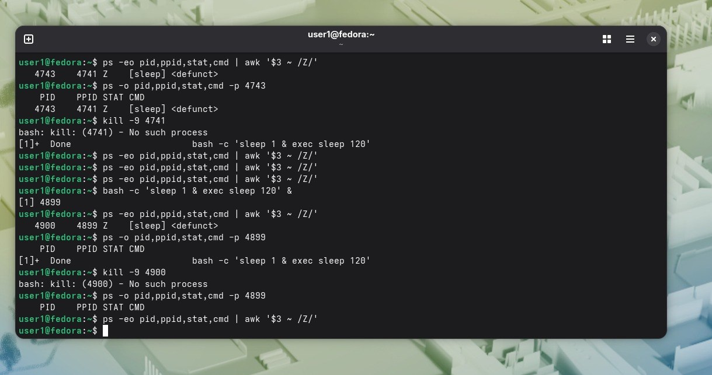

bash -c 'sleep 1 & exec sleep 120' &
[1] 4899

ps -eo pid,ppid,stat,cmd | awk '$3 ~ /Z/'
   4900    4899 Z    [sleep] <defunct>

ps -o pid,ppid,stat,cmd -p 4899
    PID    PPID STAT CMD
[1]+  Done                       bash -c 'sleep 1 & exec sleep 120'

kill -9 4900
bash: kill: (4900) - No such process

ps -eo pid,ppid,stat,cmd | awk '$3 ~ /Z/'

Это уже другой, потому что первый убился и через себя,второй просто для примера.

kill -9 5196
[1]+  Killed                     bash -c 'sleep 1 & exec sleep 120'

sleep 2
ps -eo pid,ppid,stat,cmd | awk '$3 ~ /Z/'
. 
Вопрос 1) Потому что она предназначена для принудительного завершения выполняющегося процесса,но этот процесс уже завершен.Процесса фактически не существует и некому доставить сигнал.  

Вопрос 2) Потому что их усыновляет процесс с PID 1,который постоянно считывает коды завершения своих дочерних процессов.Зомби процесса тоже.  

Вопрос 3) Исчерпанием лимита идентификаторов процессов (PID ID).

