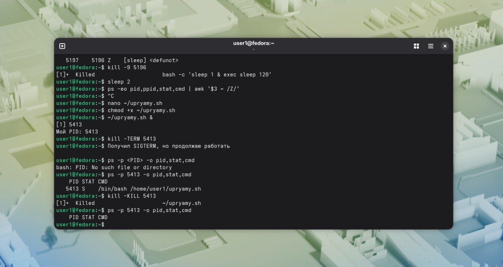
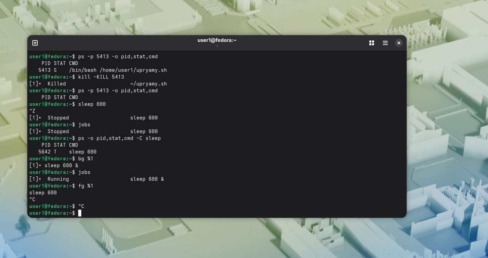

nano ~/upryamy.sh

chmod +x ~/upryamy.sh

~/upryamy.sh &
[1] 5413
Мой PID: 5413

kill -TERM 5413

Получил SIGTERM, но продолжаю работать

ps -p 5413 -o pid,stat,cmd
    PID STAT CMD
   5413 S    /bin/bash /home/user1/upryamy.sh

kill -KILL 5413
[1]+  Killed                     ~/upryamy.sh

ps -p 5413 -o pid,stat,cmd
    PID STAT CMD

sleep 600
^Z
[1]+  Stopped                    sleep 600

jobs
[1]+  Stopped                    sleep 600

ps -o pid,stat,cmd -C sleep  
    PID STAT CMD
   5642 T    sleep 600

bg %1
[1]+ sleep 600 &

jobs
[1]+  Running                    sleep 600 &

fg %1

sleep 600
^C

Вопрос 1) Потому что команда trap перехватывает сигнал sigterm и говорит при его получении вывести текст вместо того, чтобы выйти.  

Вопрос 2) Потому что sigterm позволяет программе завершить свою работу в нужном ей порядке.При sigkill она незавершает текущие транзакции,не сбрасывает измененные данные на диск,не закрывает файлы,просто останавливается сразу.Сначала лучше попробовать завершить ее с сохранением изменений.При kill =9 в бд страдают все изменения,которые еще не были записаны на диск.Если оно придет во время записи страницы данных на диск,она будет состоять наполовину из старых, наполовину из новых данных.  

Вопрос 3) S. Процесс приостановил свою работу и ждет завершения определенного события.  

Вопрос 4) ctrl+c отправляет сигнал sigint. Он останавливает и завершает текущую программу.Ctrl+z отправляет сигнал sigstp.Он приостанавливает процесс и переводит его в фоновый режим.

