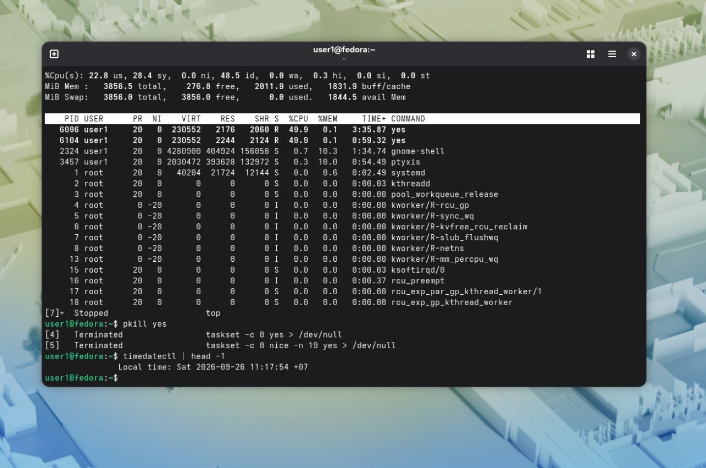

до renice:  
 |PID | NI | %CPU | PSR  | CMD |
  | 6096 | 0 | 98.8  | 0  | yes |
  | 6104 | 19 | 1.3 |  0 | yes. |
   
после:  
| PID | NI  | %CPU | PSR | CMD |
 |  6096  | 0  |90.4  | 0  |yes |
 |  6104  | 0 | 9.2  | 0  | yes. |
   
. 
(Если скрин захватывает весь экран,качество сильно страдает при пересылке,поэтому дата командой). 
Вопрос 1) На 0-98.8%, на 19-1.3%.  

Вопрос 2) Чтобы обычные пользователи не занимали слишком много системных ресурсов и ос не зависала.  

Вопрос 3) Для привязки процесса к конкретному процессорному ядру,используя только его ресурсы.

   
